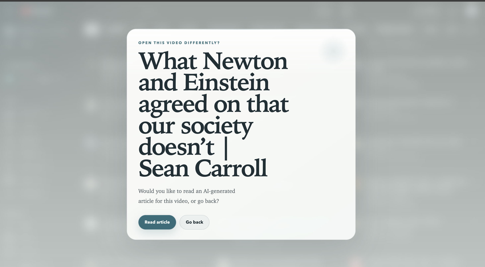
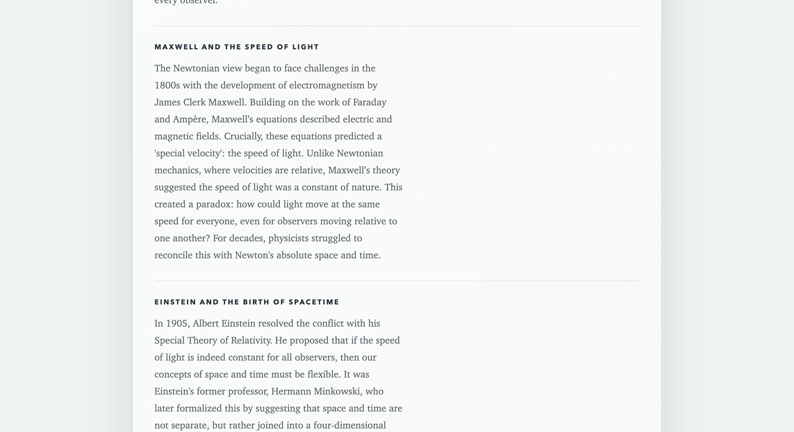
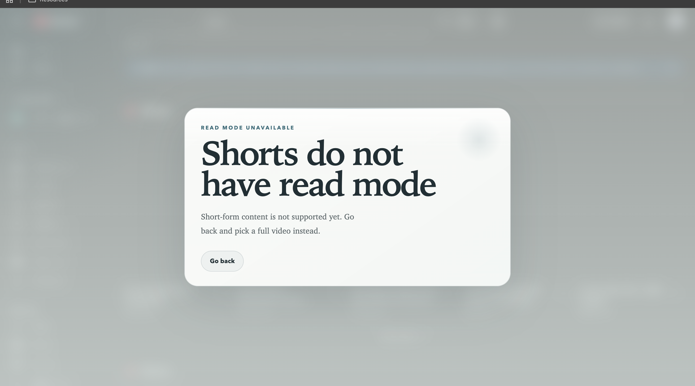

# YouTube Article Mode

YouTube Article Mode is a Chrome extension that turns YouTube into a more deliberate, reading-first experience.

Instead of dropping the user straight into video playback, the extension intercepts supported video clicks and offers a calmer choice: read an article version or go back. The goal is simple: keep the useful part of YouTube, reduce the compulsive part.

## Product preview

### Revised Feed without Thumbnails


### Article generation state



### Generated article view



### Shorts unsupported state



## Why this exists

YouTube is extremely good at making people keep watching.

This project pushes in the other direction:

- less autoplay energy
- less thumbnail temptation
- less accidental Shorts drift
- more intentional learning
- more text-first consumption

## Core features

- Intercepts standard YouTube video cards on the homepage
- Intercepts standard YouTube video cards in search results
- Opens a custom read-mode dialog before entering normal video flow
- Generates an article version of a video through a local backend
- Renders the generated article in an in-page reading overlay
- Uses the same read-mode visual language across dialogs and article screens
- Hides thumbnail-heavy presentation where possible to make browsing feel less addictive
- Removes or reduces distracting result types such as playlists, mixes, and similar clutter
- Blocks Shorts from behaving like normal supported videos
- Shows a clear unsupported-state message for short-form content

## Current user flow

### Standard videos

1. The user clicks a supported video card.
2. A read-mode prompt opens.
3. The user chooses `Read article` or `Go back`.
4. If `Read article` is chosen, the extension sends the video URL to the local backend.
5. The backend asks Gemini to generate a structured article.
6. The article is rendered inside YouTube in a custom reader view.

### Shorts

1. The user clicks a Shorts-style entry point.
2. The extension treats it as unsupported for read mode.
3. A popup explains that short-form content does not have read mode.

### Search results

1. Search result videos use the same dialog and read-mode flow as homepage videos.
2. Playlist-style and distraction-heavy result types are filtered where possible.
3. Shorts are handled separately from normal videos.

## Feature checklist

### Reading experience

- Pre-video decision dialog
- Article-generation request flow
- Full-screen article overlay
- Consistent popup styling across normal and unsupported states

### YouTube behavior changes

- Homepage video interception
- Search-result video interception
- Thumbnail minimization
- Playlist and mix reduction
- Shorts unsupported-state handling

### Backend architecture

- Local Node backend
- Gemini-based article generation
- Extension background worker to forward requests
- No end-user API key prompt inside the extension UI

## Local setup

1. Make sure Node.js is installed.
2. Get a Gemini API key.
3. Start the backend:

```bash
GEMINI_API_KEY=your_key_here node server.js
```

4. Open `chrome://extensions`
5. Turn on Developer Mode
6. Click `Load unpacked`
7. Select `/Users/karansinghmadia/Desktop/yt-article`
8. Reload the extension after code changes

For a more explicit setup walkthrough, see `/Users/karansinghmadia/Desktop/yt-article/docs/SETUP.md`.

## How article generation works

The extension does not ask the end user for an API key.

Instead, the flow is:

1. The content script captures the selected YouTube video.
2. The extension forwards that request through the background worker.
3. The local backend receives the video URL.
4. The backend calls Gemini to generate structured article content.
5. The extension renders the response as a custom reading view.

## Limitations

- Shorts do not support read mode
- The backend must be running locally for article generation to work
- Gemini support for public YouTube URLs can be sensitive depending on the video
- Unsupported, private, or restricted videos may fail
- This is currently a working prototype, not a production extension
